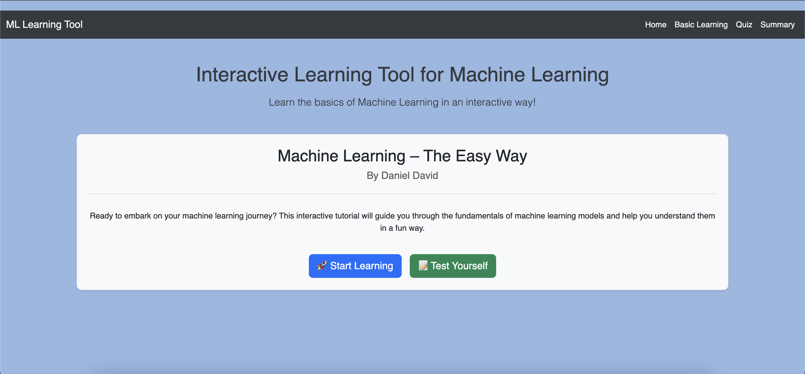
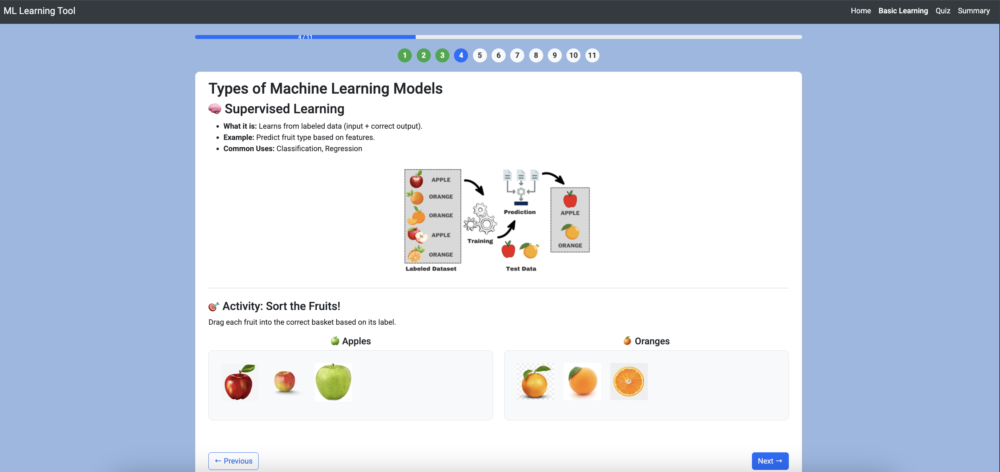
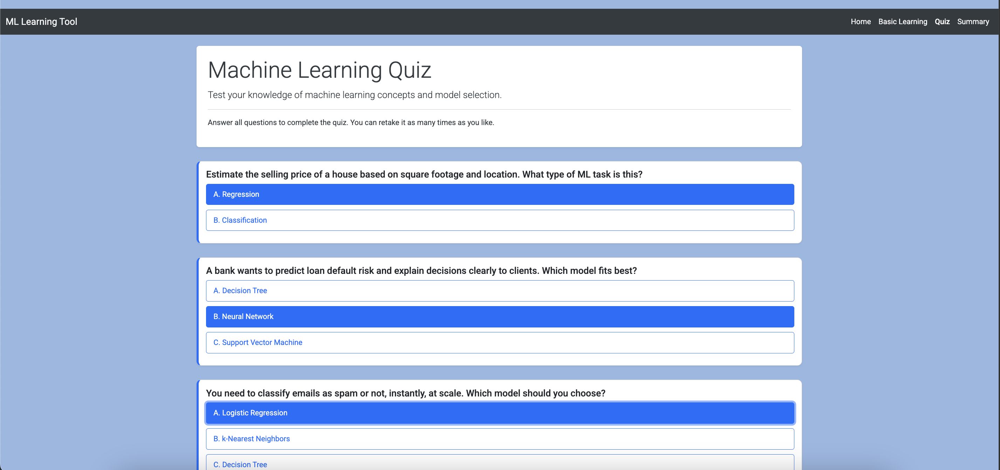

# 🧠 Interactive Learning Tool for Machine Learning

This project is a simple web-based interactive learning tool designed to introduce users to the basic concepts of Machine Learning. It provides step-by-step content, interactive quizzes, and user activity tracking.

## 🚀 Features

- **Learning Modules** – Structured learning content loaded from JSON files.
- **Interactive Quiz** – Test your knowledge through multiple-choice questions.
- **Progress Summary** – View your quiz scores and activity log.
- **User Session Tracking** – Track user activity using basic session management.

## 📸 Screenshots

### 🏠 Home Page  


### 📚 Interactive Learning Module  


### ❓ Quiz Interface  


## 🗂️ Project Structure

## Project Structure

```
/
├── LICENSE
├── Makefile
├── README.md
├── app.py
├── data
│   ├── learning_content.json
│   └── quiz_questions.json
├── requirements.txt
├── static
│   ├── css
│   │   └── styles.css
│   ├── images/
│   └── js
│       └── script.js
└── templates
    ├── index.html
    ├── learn.html
    ├── quiz.html
    └── summary.html
```

## 🛠️ Setup and Installation

1. **Clone the repository:**
```bash
git clone https://github.com/ddavid37/Machine_Learning--The_Easy_Way.git
cd Machine_Learning--The_Easy_Way
```

2.  **Create a virtual environment (recommended):**

    ```bash
    python -m venv venv
    source venv/bin/activate  # On Windows: venv\Scripts\activate
    ```

3.  **Install dependencies:**
    ```bash
    pip install -r requirements.txt
    ```

## Running the Application

1.  **Start the Flask development server:**

    ```bash
    flask run
    ```

    Or directly run the Python script:

    ```bash
    python app.py
    ```

2.  **Open your web browser** and navigate to `http://127.0.0.1:5000` (or the address provided by Flask).

## Technologies Used

- **Backend:** Python, Flask
- **Frontend:** HTML, CSS, JavaScript, Bootstrap
- **Data:** JSON